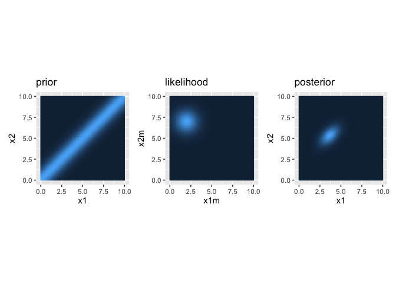

<!-- README.md is generated from README.Rmd. Please edit that file -->

# rabBITS - Bayesian Integration of Time and Space

<!-- badges: start -->
<!-- badges: end -->


The *rabBITS* package provides an R-based implementation of Bayesian
models for spatio-temporal perceptual integration, with the main purpose
of explaining tactile perceptual illusions, including the tau effect,
the kappa effect, and the cutaneous rabbit effect. The code has been
developed based on the research by Dr. Daniel Goldreich, as documented
in these articles:

- Goldreich, D. (2007). A Bayesian Perceptual Model Replicates the
  Cutaneous Rabbit and Other Tactile Spatiotemporal Illusions. PLoS ONE,
  2(3), e333. <https://doi.org/10.1371/journal.pone.0000333>
- Goldreich, D., & Tong, J. (2013). Prediction, Postdiction, and
  Perceptual Length Contraction: A Bayesian Low-Speed Prior Captures the
  Cutaneous Rabbit and Related Illusions. Frontiers in Psychology, 4.
  <https://doi.org/10.3389/fpsyg.2013.00221>
- Martel, M., Fuchs, X., Trojan, J., Gockel, V., Habets, B., & Heed, T.
  (2022). Illusory tactile movement crosses arms and legs and is coded
  in external space. Cortex, 149, 202–225.
  <https://doi.org/10.1016/j.cortex.2022.01.014>

The aim is to implement R code and replicate selected analyses and
figures from the articles to improve the accessibility and applicability
of the models for data analysis in the open source [R programming
language](https://www.r-project.org/).

## Website

Read the detailed documentation including plenty of examples here…

<https://xaverfuchs.github.io/rabBITS/>

## Installation

You can install the development version of *rabBITS* from
[GitHub](https://github.com/) with:

``` r
# install.packages("devtools")
devtools::install_github("xaverfuchs/rabBITS")
```

## Example case

Let’s assume two touch stimuli are presented on the skin. The first tap
in one position, and the second tap 5 cm further away from that, in
position 2. We refer to these parameters as *x1m* and *x2m* and will use
values of 2 and 7 cm, respecively. Let’s also assume the speed is fast,
because there are only 100 ms (0.1 s) passing between them, which is the
parameter *time_t*.

The perception on the skin also has a certain precision, which is
defined by the (inverse) precision given by the spatial standard
deviation *sigma_s*. Finally, the model assumes a relatively low
movement speed, which is given by the slow speed prior, defined as
*sigma_v*.

The package allows to easily compute the prior, likelihood, and
posterior distributions for visualization and inference.

## Example case

Let’s assume two touch stimuli are presented on the skin. The first tap
in one position, and the second tap 5 cm further away from that, in
position 2. We refer to these parameters as *x1m* and *x2m* and will use
values of 2 and 7 cm, respecively. Let’s also assume the speed is fast,
because there are only 100 ms (0.1 s) passing between them, which is the
parameter *time_t*

The perception on the skin also has a certain precision, which is
defined by the (inverse) precision given by the spatial standard
deviation *sigma_s*, here 1 cm. Finally, the model assumes a relatively
low movement speed, which is given by the slow speed prior, defined as
*sigma_v*, here 10 cms/s.

The package allows to easily compute the prior, likelihood, and
posterior distributions for visualization and inference.

### Plots of prior, likelihood, and posterior

``` r
library(rabBITS)
library(ggplot2)
library(patchwork)

### XXX Compute prior density
x1_range <- c(0, 10) #range for taps
x2_range <- c(0, 10)

x1_res <- 100 #resolution for graphs
x2_res <- 100

priorMat <- expand.grid(x1=seq(x1_range[1], x1_range[2], length.out = x1_res), x2=seq(x2_range[1], x2_range[2], length.out = x2_res))

priorMat$p <- prior_2Tap(x1 = priorMat$x1, x2 = priorMat$x2, sigma_v = 10, time_t = 0.1)

p1 <- ggplot(priorMat, aes(x=x1, y=x2, fill=p)) +
  geom_raster() +
  coord_fixed() +
  ggtitle("prior") +
  theme(legend.position = "none")


### XXX Compute likelihood
x1m_range <- c(0, 10) #range for taps
x2m_range <- c(0, 10)

x1m_res <- 100 #resolution for graphs
x2m_res <- 100


likelihoodMat <- expand.grid(x1m=seq(x1m_range[1], x1m_range[2], length.out = x1m_res), x2m=seq(x2m_range[1], x2m_range[2], length.out = x2m_res))

likelihoodMat$l <- likelihood_2Tap_EqVar(x1m = likelihoodMat$x1m, x2m = likelihoodMat$x2m, x1=2, x2=7, sigma_s = 1)

p2 <- ggplot(likelihoodMat, aes(x=x1m, y=x2m, fill=l)) +
  geom_raster() +
  coord_fixed() +
  ggtitle("likelihood") +
  theme(legend.position = "none")


### XXX Compute posterior density
posteriorMat <- expand.grid(x1=seq(x1_range[1], x1_range[2], length.out = x1_res), x2=seq(x2_range[1], x2_range[2], length.out = x2_res))

posteriorMat$p <- posterior_2Tap_EqVar(x1m = 2, x2m = 7, x1 = posteriorMat$x1, x2 = posteriorMat$x2, sigma_s = 1, sigma_v = 10, time_t = 0.1)

p3 <- ggplot(posteriorMat, aes(x=x1, y=x2, fill=p)) +
  geom_raster() +
  coord_fixed() +
  ggtitle("posterior") +
  theme(legend.position = "none")


# join plots
p1 + p2 + p3
```



### Parameters of the posterior distribution

According to Bayesian perception models, the posterior corresponds to
perception. That is, the a position that is perceived can be computed by
a maximum posterior estimate, such as the mode of the posterior
distribution.

The parameters of the posterior distribution can easily be computed, as
shown in this example. *x1_star* and *x2_star* are the posterior modes
for tap 1 and 2, respectively.

``` r
posterior_params_2Tap_EqVar(x1m = 2, x2m = 7, time_t = 0.1, sigma_s = 1, sigma_v = 10)
#> $x1_star
#> [1] 3.666667
#> 
#> $x2_star
#> [1] 5.333333
#> 
#> $common_sigma_square
#> [1] 0.6666667
#> 
#> $correlation
#> [1] 0.5
```
